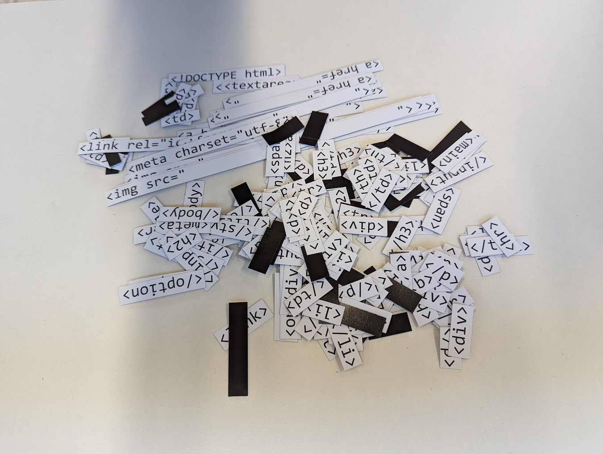
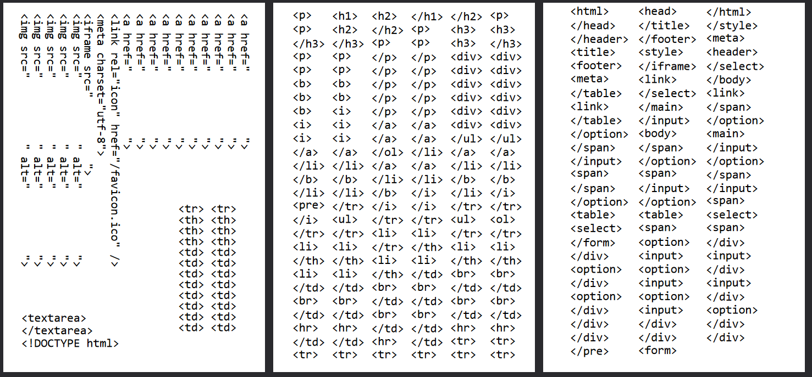

# HTML Fridge Magnets

[inspiration](https://nonnullish.pages.dev/posts/handwritten-websites/)

HTML fridge magnets!

## Magnetic paper

The paper I use is from the [magnet shop](https://www.themagnetshop.co.uk/magnetic-sheets-printable/a4-magnetic-photo-paper-inkjet-compatible-magnets-matt/).

## Printing

I use an inkjet printer, as that's what the provider of the paper suggests.

## Cutting

I used a manual hand-guillotine.

## Setup (simple)

Print [`print.pdf`](./print.pdf) and cut it out.

## Setup (complex)

Edit which tags are included in [`magnets.txt`](./magnets.txt). This is a CSV file with `£` as the delimiter.

Generate an SVG file with [`make.py`](./make.py). It will be organised in columns by number of characters.

Use an SVG editing software (e.g., [Inkscape](https://inkscape.org/)) to organise the tags onto A4 pages, as I did above.
