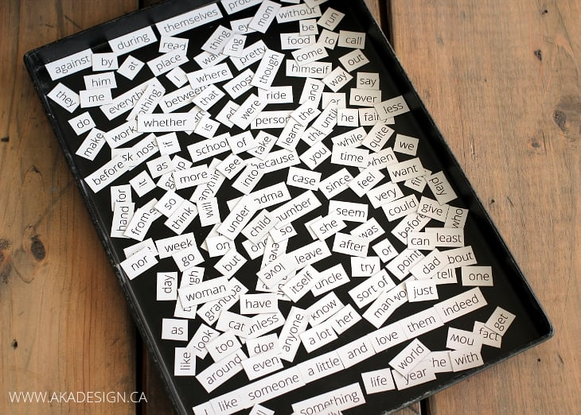

# HTML Fridge Magnets

[Inspiration](https://nonnullish.pages.dev/posts/handwritten-websites/)

You know Poetry fridge magnets?

What if instead of words, they were HTML tags?

We could make our own with magnetic paper.

## Magnetic paper

The paper I use is from the [magnet shop](https://www.themagnetshop.co.uk/magnetic-sheets-printable/a4-magnetic-photo-paper-inkjet-compatible-magnets-matt/).

## Printing

I use an inkjet printer, as that's what the provider of the paper suggests.

## Cutting

I use either a hand-guillotine or an automatic cutter.
